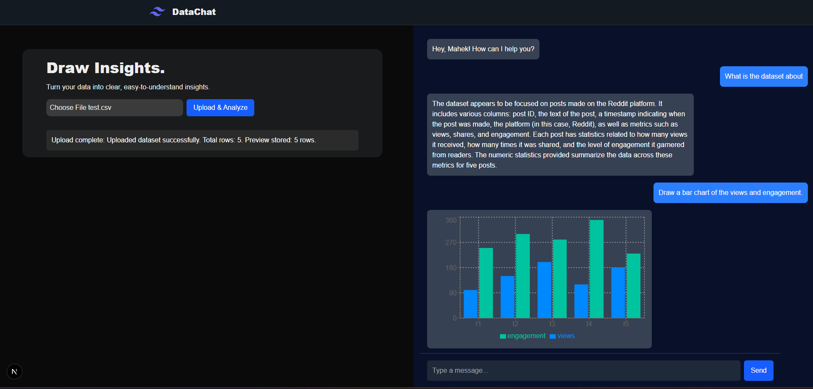
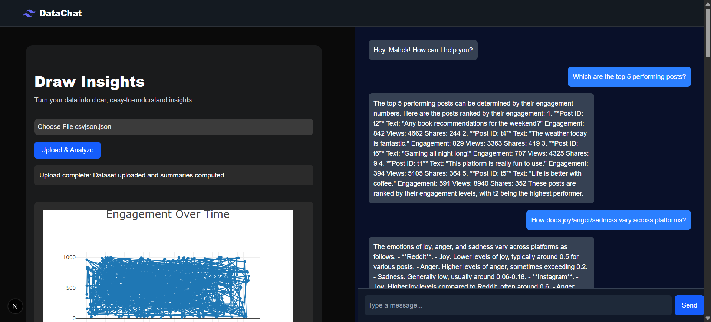
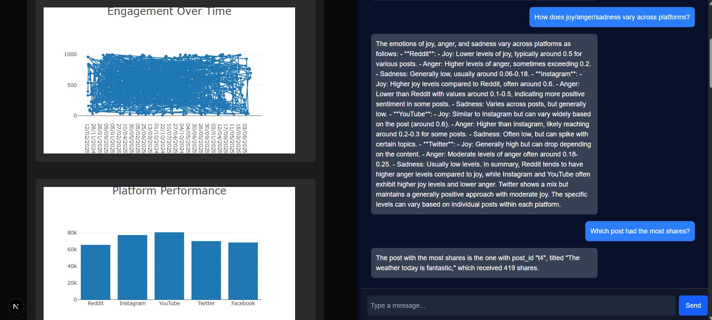
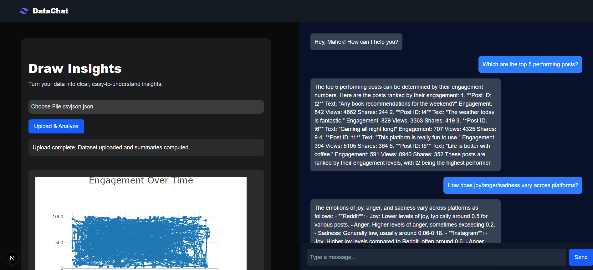
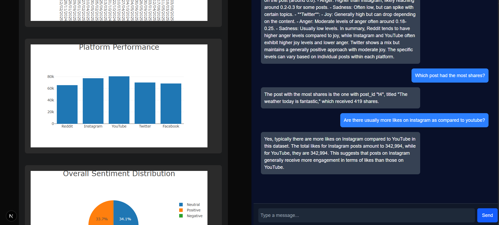
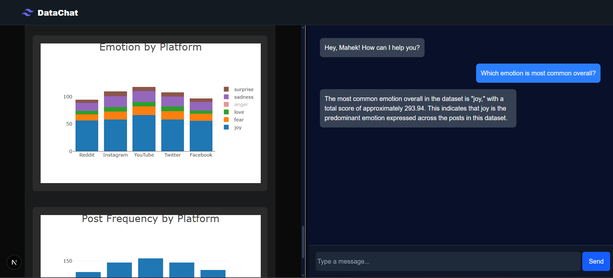
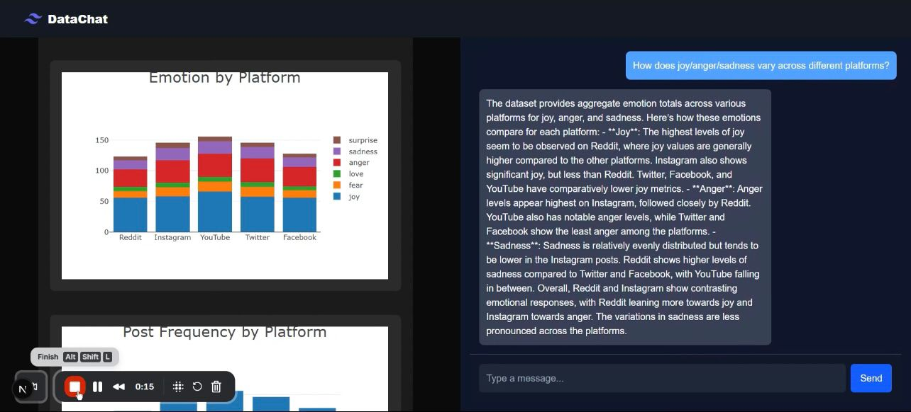
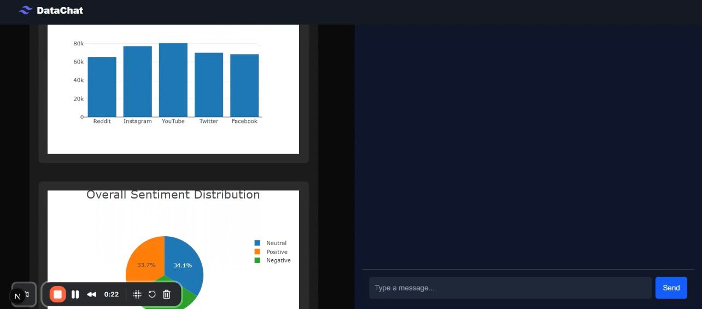

# 💬 DataChat – Chat with Your Data

[](https://nextjs.org/)
[](https://nodejs.org/)
[](https://plotly.com/)
[](https://opensource.org/licenses/MIT)


**DataChat** is an AI-powered web application that allows users to **upload datasets**, **automatically generate visual insights**, and **converse with their data** through natural language queries.  

It bridges the gap between **data visualization** and **AI-driven analytics**, enabling anyone to explore datasets effortlessly.

<p align="center">  <br> <em>User Interface</em> </p>


## 🚀 Features

- 📁 **Dataset Upload** – Upload CSV or JSON files for instant analysis  
- 📊 **Auto Chart Generation** – Automatically generate interactive charts with Plotly  
- 🤖 **Chat with Data** – Ask questions about your dataset using natural language  
- 💾 **Data Persistence** – Store uploaded datasets and chat history in MongoDB  
- ⚡ **Modern UI** – Built with Next.js and Tailwind CSS for a smooth experience  

## 🖼️ Demonstrations
<p align="center">   </p>
<!-- <p align="center">   </p>
<p align="center">  </p> -->
<p align="center">  </p>
<p align="center">  <br>  </p>
<p align="center">  <br> </p>
<p align="center">  <br>  </p>
<p align="center">  <br>  </p>

## 🧠 Tech Stack

| Layer | Technology |
|-------|-------------|
| **Frontend** | [Next.js](https://nextjs.org/), [React](https://react.dev/), [Tailwind CSS](https://tailwindcss.com/) |
| **Charts** | [Plotly.js](https://plotly.com/javascript/) |
| **Backend** | Next.js API Routes |
| **AI Integration** | [OpenAI API](https://platform.openai.com/docs/api-reference) |
| **Database** | [MongoDB](https://www.mongodb.com/) |
| **File Parsing** | [Papaparse](https://www.papaparse.com/) / [Multer](https://github.com/expressjs/multer) |

## ⚙️ Installation & Setup

### 1. Clone the repository
``` bash
git clone https://github.com/yourusername/datachat.git
cd datachat
```

### 2. Install dependencies
``` bash
npm install
```

###3. Set up environment variables
Create a .env.local file in your project root:
``` bash
OPENAI_API_KEY=your_openai_api_key
MONGODB_URI=your_mongodb_connection_string
```

### 4. Run the development server
``` bash
npm run dev
```

### 5. Open http://localhost:3000  to view the app in your browser.

